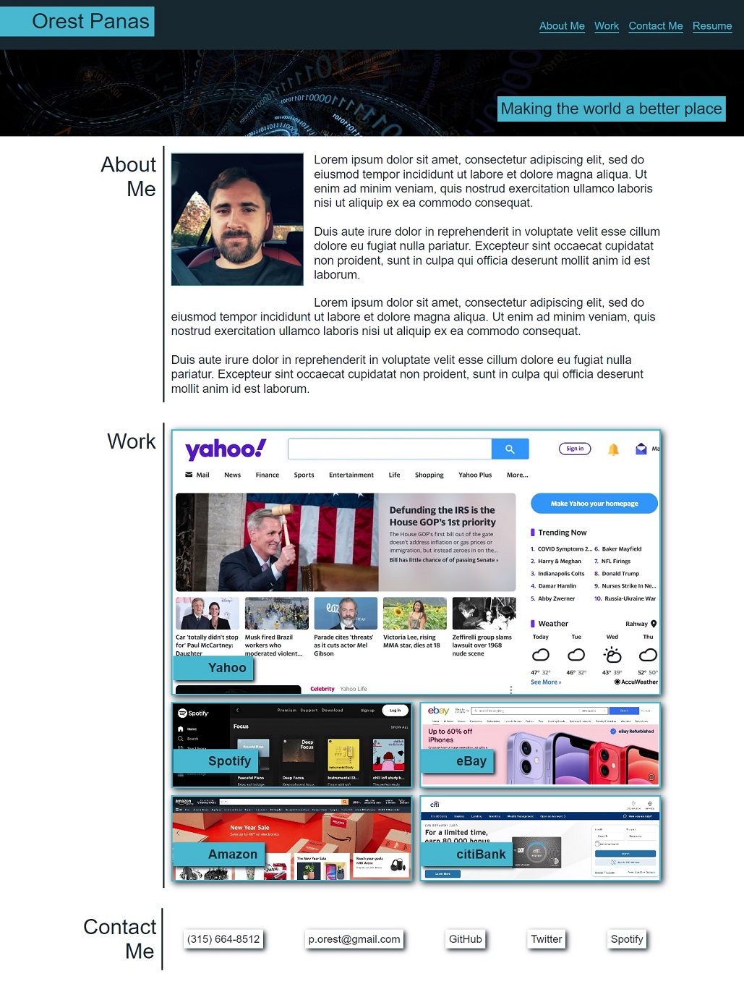

# Orest Panas

## Advanced CSS Challenge: Professional Portfolio

```

Making the world a better place.
This website provides information about the your potential number one employee.
It provides a full description of one's charachter as well as shows examples of the empecable  work done so far in the career.
Website is optimized to accessibility standards using semantic html elements.

```
The following image shows the web application's appearance and functionality:




[Professional Portfolio Website](https://00rest.github.io/Challenge-02-Professional-Portfolio/)


```
AS AN employer
You can review samples of their work and assess whether one is good candidate for an open position.

When you load their portfolio, you then presented with the developer's name, a recent photo or avatar, and links to sections about them, their work, and how to contact them

When you click one of the links in the navigation, the UI scrolls to the corresponding section.

When you click on the link to the section about their work, the UI scrolls to a section with titled images of the developer's applications.

When you are presented with the developer's first application, that application's image is larger in size than the others.

When you click on the images of the applications, you are taken to that deployed application.

When you resize the page or view the site on various screens and devices, you are presented with a responsive layout that adapts to my viewport.

```